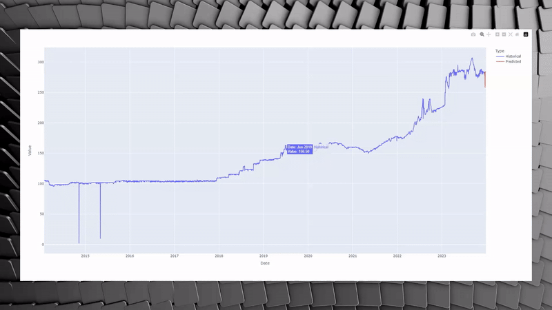

<a id="readme-top"></a>
[![Contributors][contributors-shield]][contributors-url]
[![Forks][forks-shield]][forks-url]
[![Stargazers][stars-shield]][stars-url]
[![Issues][issues-shield]][issues-url]
[![LinkedIn][linkedin-shield]][linkedin-url]
[![Upwork][Upwork-badge]][Upwork-url]

<!-- PROJECT LOGO -->
<br />
<div align="center">
  <a href="https://github.com/hiraarif-13/Currency-Rate-Exchange-Recommendation-System">
    
  </a>

<h2 align="center">Currency Exchange Rate Recommendation System</h2>

  <p align="center">
    A dynamic Currency Exchange Rate Recommendation System with predictive analytics to empower your trading decisions!
    <br />
    <a href="https://github.com/hiraarif-13/Currency-Rate-Exchange-Recommendation-System/tree/main/Documentations"><strong>Explore the docs »</strong></a>
    <br />
    <br />
    <a href="https://hiraarif-13.github.io/Currency-Rate-Exchange-Recommendation-System/Resources/demo.html">View Demo</a>
    ·
    <a href="https://github.com/hiraarif-13/Currency-Rate-Exchange-Recommendation-System/issues">Report Bug</a>
    ·
    <a href="https://github.com/hiraarif-13/Currency-Rate-Exchange-Recommendation-System/issues">Request Feature</a>
  </p>
</div>


<!-- TABLE OF CONTENTS -->
<details>
  <summary>Table of Contents</summary>
  <ol>
    <li>
      <a href="#about">About The Project</a>
      <ul>
        <li><a href="#built-with">Built With</a></li>
      </ul>
    </li>
    <li>
      <a href="#getting-started">Getting Started</a>
      <ul>
        <li><a href="#prerequisites">Prerequisites</a></li>
        <li><a href="#installation">Installation</a></li>
      </ul>
    </li>
    <li><a href="#project-structure">Project Structure</a></li>
    <li>
        <a href="#usage">Usage</a>
        <ol>
            <li><a href="#importing-libraries">Importing Libraries</a></li>
            <li><a href="#data-loading">Data Loading</a></li>
            <li><a href="#data-preprocessing">Data Preprocessing</a></li>
            <li><a href="#eda">Exploratory Data Analysis (EDA)</a></li>
            <li>
                <a href="#feature-engineering">Feature Engineering</a>
                <ol>
                    <li><a href="#data-normalization">Data Normalization</a></li>
                    <li><a href="#feature-selection">Feature Selection</a></li>
                    <li><a href="#decision">Decision on Which Features to Keep</a></li>
                </ol>
            </li>
            <li><a href="#model-training-evaluation">Model Training and Evaluation</a></li>
            <li><a href="#recommendation-engine">Recommendation Engine</a></li>
            <li><a href="#forecasting">Forecasting</a></li>
        </ol>
    </li>
    <li><a href="#contributing">Contributing</a></li>
    <li><a href="#contact">Contact</a></li>
    <li><a href="#acknowledgments">Acknowledgments</a></li>
  </ol>
</details>


<!-- ABOUT THE PROJECT -->

<a id="about"></a>

## About The Project

<p align="center">
<a href="https://github.com/hiraarif-13/Currency-Rate-Exchange-Recommendation-System/tree/main/Images/After/demo.gif">
    
  </a>
</p>

[//]: # ([![Product Name Screen Shot][product-screenshot]]&#40;https://github.com/hiraarif-13/Currency-Rate-Exchange-Recommendation-System/tree/main/Images/After/demo.gif&#41;)

The Currency Exchange Rate Prediction System is a Python application designed to assist users in analyzing historical
currency exchange rates. It predicts future rates and makes recommendations on buying or selling currencies.

<p align="right"><a href="#readme-top"><strong>Back to Top ⬆️</strong></a></p>

<a id="built-with"></a>

### Built With

The Currency Exchange Rate Recommendation System is built using a combination of data analysis and machine learning
libraries in Python. Here's a list of the main components:

* [![Python][Python.org]][Python-url]
* [![Pandas][Pandas.pydata.org]][Pandas-url]
* [![NumPy][NumPy.org]][NumPy-url]
* [![Plotly][Plotly.com]][Plotly-url]
* [![Matplotlib][Matplotlib.org]][Matplotlib-url]
* [![Seaborn][Seaborn.pydata.org]][Seaborn-url]
* [![Scikit-Learn][Scikit-learn.org]][Scikit-learn-url]
* [![XGBoost][XGBoost.readthedocs.io]][XGBoost-url]
* [![Statsmodels][Statsmodels.org]][Statsmodels-url]
* [![yfinance][yfinance-url]][yfinance]
* [![SciPy][SciPy.org]][SciPy-url]
* [![Colab][Collab-shield]][Collab-url]

<p align="right"><a href="#readme-top"><strong>Back to Top ⬆️</strong></a></p>

<a id="getting-started"></a>

## Getting Started

<a id="prerequisites"></a>

### Prerequisites

Before you begin, make sure your system meets the following requirements:

- **Python 3.10+**: The system is designed to work with Python 3.10 or newer. If you haven't already, download the
  latest Python version from the [official Python website](https://www.python.org/downloads/).
- **Pip**: This is the package installer for Python. It's usually included with your Python installation. If you need to
  install it separately, follow the instructions on
  the [pip documentation page](https://pip.pypa.io/en/stable/installation/).
- **Virtual Environment**: It's highly recommended to use a virtual environment to manage dependencies for the project
  and keep your Python setup clean. You can create one using `venv` which is included in the Python standard library.
  For more information on creating and using virtual environments, refer to
  the [venv module documentation](https://docs.python.org/3/library/venv.html).

By ensuring these prerequisites, you'll have a smooth setup and a contained environment for running the Currency
Exchange Rate Recommendation System.

<a id="installation"></a>

### Installation

1. Clone the repository to your local machine.

   ```bash
   git clone https://github.com/hiraarif-13/Currency-Rate-Exchange-Recommendation-System.git
   ```

2. Navigate to the project directory.

3. Run `setup.py` to install necessary libraries listed in `requirements.txt`.

   ```bash
   python setup.py
   ```

<p align="right"><a href="#readme-top"><strong>Back to Top ⬆️</strong></a></p>

<a id="project-structure"></a>

## Project Structure

- `Currency Exchange Recommendation System.ipynb`: Notebook with all the analysis and prediction code.
- `setup.py`: Script to set up the project dependencies.
- `requirements.txt`: List of libraries required for the project.

<p align="right"><a href="#readme-top"><strong>Back to Top ⬆️</strong></a></p>

<a id="usage"></a>

## Usage

<a id="importing-libraries"></a>

### Importing Libraries

The system utilizes a variety of Python libraries:

- `plotly.express` and `plotly.graph_objects` for interactive plotting.
- `pandas` for data manipulation and analysis.
- `numpy` for numerical computations.
- `matplotlib.pyplot` and `seaborn` for static plotting.
- `sklearn` for machine learning tasks, including model selection and feature selection.
- `xgboost` for the XGBoost algorithm implementation.
- `statsmodels` for the implementation of many statistical models.
- `yfinance` for fetching historical market data.
- `warnings` to suppress warnings for cleaner output.

<a id="data-loading"></a>

### Data Loading

The yfinance library is used to download historical exchange rate data for the specified currency pair (e.g., PKR to
USD). The data is then saved to a CSV file for later use.

```python
base_currency = 'PKR'
target_currency = 'USD'
df = yf.download(f"{target_currency}{base_currency}=X", start="2013-12-20", end="2023-12-20")
df.reset_index(inplace=True)
print("Data collected successfully:")
print(df.head())
print(df.tail())
```

```commandline
[*********************100%%**********************]  1 of 1 completedData collected successfully:
        Date        Open        High         Low       Close   Adj Close  \
0 2013-12-20  105.500000  106.199997  104.970001  106.199997  106.199997   
1 2013-12-23  104.790001  106.099998  104.699997  104.830002  104.830002   
2 2013-12-24  104.639999  106.150002  103.930000  106.150002  106.150002   
3 2013-12-25  104.639999  106.150002  103.930000  106.150002  106.150002   
4 2013-12-26  103.830002  106.150002  103.830002  106.150002  106.150002   

   Volume  
0       0  
1       0  
2       0  
3       0  
4       0  
           Date        Open        High         Low       Close   Adj Close  \
2600 2023-12-13  282.249054  282.249054  282.137268  282.175873  282.175873   
2601 2023-12-14  279.199738  283.299988  278.443207  283.299988  283.299988   
2602 2023-12-15  277.142853  283.000000  277.142853  283.000000  283.000000   
2603 2023-12-18  280.193359  280.193359  278.257080  279.846649  279.846649   
2604 2023-12-19  278.134735  283.000000  277.549927  278.257080  278.257080   

      Volume  
2600       0  
2601       0  
2602       0  
2603       0  
2604       0 
```

If you need to adjust the variables in the data loading module of the Currency Exchange Rate Recommendation System to
fit different requirements, you can modify the following parameters:

- `base_currency`: Set this variable to the currency code of the base currency you are interested in.
- `target_currency`: Set this to the currency code of the target currency you wish to compare against the base currency.
- `start_date`: The beginning date for the historical data you want to download.
- `end_date`: The ending date for the historical data range.

Here are the statements you would use to change these variables according to your needs:

```python
# Set the base and target currency codes
base_currency = 'YourBaseCurrencyCode'  # For example, 'EUR' for Euro
target_currency = 'YourTargetCurrencyCode'  # For example, 'JPY' for Japanese Yen

# Define the date range for historical data
start_date = 'YYYY-MM-DD'  # For example, '2020-01-01'
end_date = 'YYYY-MM-DD'  # For example, '2024-01-01'

# Download historical data using yfinance
df = yf.download(f"{target_currency}{base_currency}=X", start=start_date, end=end_date)
df.reset_index(inplace=True)

# Specify the path for saving the CSV file
csv_file_path = 'path/to/your/currency_data.csv'  # For example, 'data/currency_pair_data.csv'

# Save the DataFrame to a CSV file
df.to_csv(csv_file_path, index=False)

# Load data from the CSV file
df = pd.read_csv(csv_file_path)
```

By altering these variables, you can tailor the data loading process to fetch and prepare the specific currency exchange
rate data that you are interested in analyzing with the system.

<a id="data-preprocessing"></a>

### Data Preprocessing

This step includes handling missing values, converting date strings to datetime objects, and filling any remaining
missing values with forward-fill method to maintain data continuity.

```python
# Fill missing values
df.fillna(method='ffill', inplace=True)

# Convert to datetime
df['Date'] = pd.to_datetime(df['Date'])
```

<a id="eda"></a>

### Exploratory Data Analysis (EDA)

EDA is performed to understand data distributions and relationships. This includes generating a candlestick chart with
volume and a box plot to visualize the distribution of data.

| Candle Stick Chart | Boxplot | Seasonality Trend |
|--------------------|---------|-------------------|
| [![Candle Stick Chart][candle-stick-chart-screenshot-before]](https://hiraarif-13.github.io/Currency-Rate-Exchange-Recommendation-System/Resources/candle_stick_chart.html) | [![Boxplot][boxplot-screenshot-before]](https://github.com/hiraarif-13/Currency-Rate-Exchange-Recommendation-System/tree/main/Images/Before/boxplot.png) | [![Seasonality Trend][seasonality-trend-screenshot]](https://github.com/hiraarif-13/Currency-Rate-Exchange-Recommendation-System/tree/main/Images/Before/seasonality_trend.png) |

This module also removes columns that do not contribute any information about variability or spread in the data
e.g., `Volume`

```python
df.drop(columns=['Volume'], inplace=True)
```

<a id="feature-engineering"></a>

### Feature Engineering

The system creates new features like lag features (to capture temporal dependencies) and technical indicators such as
Simple Moving Average (SMA) and Relative Strength Index (RSI), which are widely used in technical analysis.

<a id="data-normalization"></a>

#### Data Normalization

1. Skewness of the features is assessed
2. Outlier handling is performed through Interquartile Range (IQR) capping.

[![Boxplot][boxplot-screenshot-after]](https://github.com/hiraarif-13/Currency-Rate-Exchange-Recommendation-System/tree/main/Images/After/boxplot.png)

<a id="feature-selection"></a>

#### Feature Selection

Features are then selected based on their:

1. Correlation with the target variable.
2. Recursive Feature Elimination (RFE) using a Random Forest Regressor.

<a id="visualization"></a>

#### Visualization

[![Visualise][visualization-screenshot]](https://github.com/hiraarif-13/Currency-Rate-Exchange-Recommendation-System/tree/main/Images/After/visualization.png)

<a id="decision"></a>

#### Decision on Which Features to Keep

Based on both the feature selection methods, `n` features will be selected.

<a id="model-training-evaluation"></a>

### Model Training and Evaluation

Several models are trained and evaluated:

- Linear Regression: For linear relationships.
- Random Forest Regressor: For non-linear relationships and feature importance ranking.
- Gradient Boosting Regressor: For sequential error reduction.
- XGBoost Regressor: For a scalable and efficient gradient boosting implementation.

The best model is selected based on Mean Squared Error (MSE) and R-squared (R2) metrics.

[![Model Training and Evaluation][model_training_evaluation-screenshot]](https://github.com/hiraarif-13/Currency-Rate-Exchange-Recommendation-System/tree/main/Images/After/model_training_evaluation.png)

<a id="recommendation-engine"></a>

### Recommendation Engine

A function is designed to recommend whether to buy or sell based on the predictions of the best model and the current
price.

```python
# Decision recommendation based on the best model's predictions
def recommend_decision(predictions, current_price):
    future_price = np.mean(predictions)
    if future_price > current_price:
        return "Buy"
    else:
        return "Sell"


current_price = df['Close'].iloc[-1]
best_model = models[best_model_name]
future_predictions = best_model.predict(X_test)
decision = recommend_decision(future_predictions, current_price)
print(f"Recommended action: {decision} it now!")
```

```commandline
Recommended action: Sell it now!
```

<a id="forecasting"></a>

### Forecasting

The system can forecast the exchange rate for a specified number of future days using the best-performing model.

[![Forecasting][forecasting-screenshot]](https://hiraarif-13.github.io/Currency-Rate-Exchange-Recommendation-System/Resources/demo.html)

<p align="right"><a href="#readme-top"><strong>Back to Top ⬆️</strong></a></p>

<a id="contributing"></a>

## Contributing

Feel free to fork the project, make changes, and submit a pull request.

<a id="contact"></a>

## Contact

* [![Upwork][Upwork-badge]][Upwork-url]
* [![LinkedIn][LinkedIn-badge]][LinkedIn-url]
* [![Gmail][Gmail-badge]][Gmail-url]

<a id="acknowledgments"></a>

## Acknowledgments

- The dataset used in this project is courtesy of Yahoo Finance.
- This project is inspired by the challenges faced by currency traders in predicting exchange rates.

<p align="right"><a href="#readme-top"><strong>Back to Top ⬆️</strong></a></p>

<!-- MARKDOWN LINKS & IMAGES -->
<!-- https://www.markdownguide.org/basic-syntax/#reference-style-links -->

[contributors-shield]: https://img.shields.io/github/contributors/hiraarif-13/Currency-Rate-Exchange-Recommendation-System.svg?style=for-the-badge

[contributors-url]: https://github.com/hiraarif-13/repo_name/graphs/contributors

[forks-shield]: https://img.shields.io/github/forks/hiraarif-13/Currency-Rate-Exchange-Recommendation-System.svg?style=for-the-badge

[forks-url]: https://github.com/hiraarif-13/repo_name/network/members

[stars-shield]: https://img.shields.io/github/stars/hiraarif-13/Currency-Rate-Exchange-Recommendation-System.svg?style=for-the-badge

[stars-url]: https://github.com/hiraarif-13/repo_name/stargazers

[issues-shield]: https://img.shields.io/github/issues/hiraarif-13/Currency-Rate-Exchange-Recommendation-System.svg?style=for-the-badge

[issues-url]: https://github.com/hiraarif-13/repo_name/issues

[linkedin-shield]: https://img.shields.io/badge/-LinkedIn-black.svg?style=for-the-badge&logo=linkedin&colorB=555

[linkedin-url]: https://www.linkedin.com/in/hira-arif-31a45620b/

[product-screenshot]: Images/After/demo.gif

[Python.org]: https://img.shields.io/badge/python-3670A0?style=for-the-badge&logo=python&logoColor=ffdd54

[Python-url]: https://python.org/

[Jupyter.org]: https://img.shields.io/badge/Jupyter-F37626.svg?&style=for-the-badge&logo=Jupyter&logoColor=white

[Jupyter-url]: https://jupyter.org/

[Pandas.pydata.org]: https://img.shields.io/badge/pandas-150458?style=for-the-badge&logo=pandas&logoColor=white

[Pandas-url]: https://pandas.pydata.org/

[NumPy.org]: https://img.shields.io/badge/numpy-013243?style=for-the-badge&logo=numpy&logoColor=white

[NumPy-url]: https://numpy.org/

[Plotly.com]: https://img.shields.io/badge/plotly-3F4F75?style=for-the-badge&logo=plotly&logoColor=white

[Plotly-url]: https://plotly.com/

[Matplotlib.org]: https://img.shields.io/badge/matplotlib-11557c?style=for-the-badge&logo=matplotlib&logoColor=white

[Matplotlib-url]: https://matplotlib.org/

[Seaborn.pydata.org]: https://img.shields.io/badge/seaborn-507DCA?style=for-the-badge&logo=seaborn&logoColor=white

[Seaborn-url]: https://seaborn.pydata.org/

[Scikit-learn.org]: https://img.shields.io/badge/scikit_learn-F7931E?style=for-the-badge&logo=scikit-learn&logoColor=white

[Scikit-learn-url]: https://scikit-learn.org/

[XGBoost.readthedocs.io]: https://img.shields.io/badge/XGBoost-28A745?style=for-the-badge&logo=xgboost&logoColor=white

[XGBoost-url]: https://xgboost.readthedocs.io/

[Statsmodels.org]: https://img.shields.io/badge/statsmodels-DD1100?style=for-the-badge&logo=statsmodels&logoColor=white

[Statsmodels-url]: https://www.statsmodels.org/

[yfinance-url]: https://img.shields.io/badge/yfinance-0078D4?style=for-the-badge&logo=yfinance&logoColor=white

[yfinance]: https://pypi.org/project/yfinance/

[SciPy.org]: https://img.shields.io/badge/SciPy-8CAAE6?style=for-the-badge&logo=scipy&logoColor=white

[SciPy-url]: https://scipy.org/

[Collab-url]: https://colab.research.google.com/drive/1nYGFvYBqhVpFT0lHva6IcUm6wkLW7B5x?usp=sharing

[Collab-shield]: https://colab.research.google.com/assets/colab-badge.svg

[candle-stick-chart-screenshot-before]: Images/Before/candle_stick_chart.png

[boxplot-screenshot-before]: Images/Before/boxplot.png

[boxplot-screenshot-after]: Images/After/boxplot.png

[seasonality-trend-screenshot]: Images/Before/seasonality_trend.png

[visualization-screenshot]: Images/After/visualization.png

[model_training_evaluation-screenshot]: Images/After/model_training_evaluation.png

[forecasting-screenshot]: Images/After/candle_stick_chart.png

[LinkedIn-badge]: https://img.shields.io/badge/LinkedIn-0077B5?style=for-the-badge&logo=linkedin&logoColor=white

[LinkedIn-url]: https://linkedin.com/in/your-linkedin-username

[Gmail-badge]: https://img.shields.io/badge/Gmail-D14836?style=for-the-badge&logo=gmail&logoColor=white

[Gmail-url]: mailto:hiraarif904@gmail.com

[Upwork-badge]: https://img.shields.io/badge/Upwork-6FDA44?style=for-the-badge&logo=upwork&logoColor=white

[Upwork-url]: https://www.upwork.com/freelancers/hiraa2
